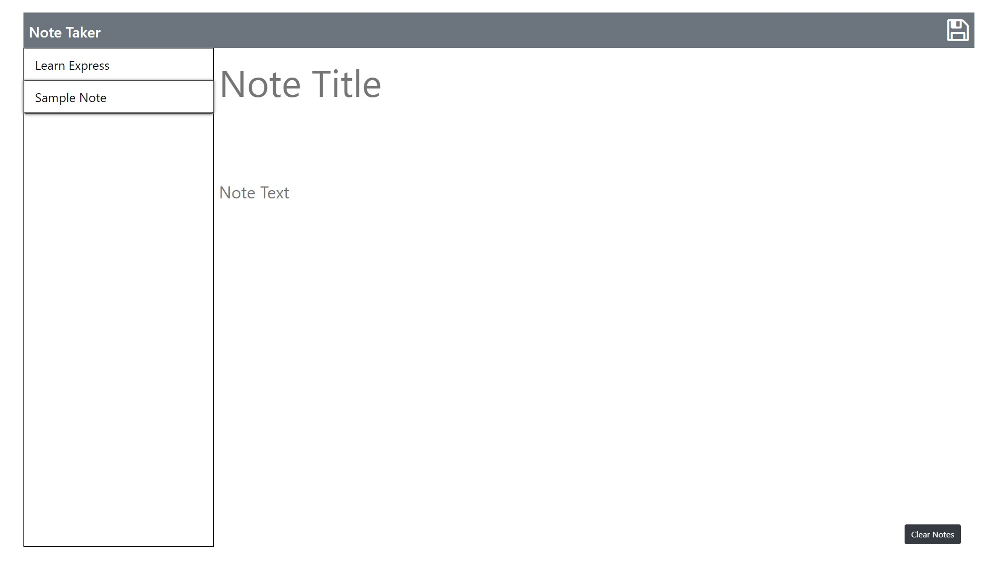

 
# Express Note Taker

### [My GitHub](https://github.com/matildabrantley)
## Table of Contents:
* [Installing](#installing)
* [License](#license)
* [Questions](#questions)
* [Screenshot](#screenshot)
## Description
Create and retrieve notes with an Express server in JSON file format.
## Installing 
* The following command installs dependencies:
  * npm i
## License
The project is licensed under the MIT License license.
## Questions
Questions about the project may be directed to my email at matildahbrantley@gmail.com.
Here is a link to [my GitHub](https://github.com/matildabrantley) 
for access my other work.
## Screenshot
